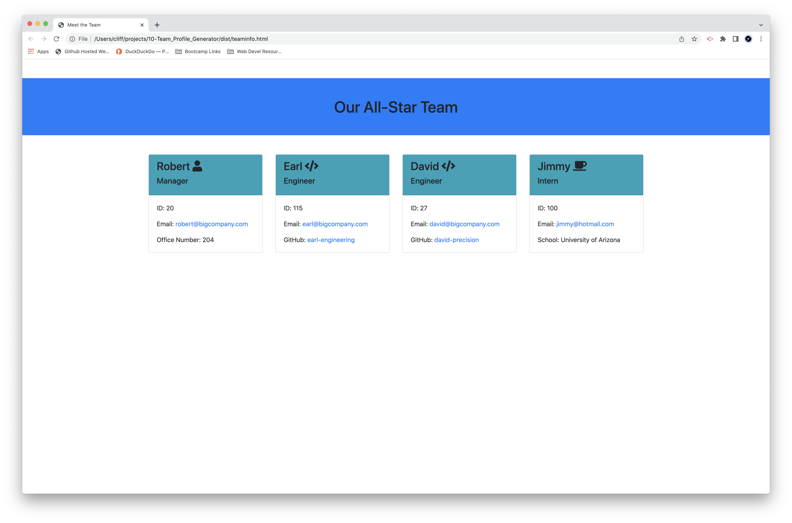

# Team Profile Generator

## Licensing-

Link: [MIT License](https://opensource.org/licenses/MIT)

## Description-

  This is a Node.js command-line JavaScript app that takes information about employees on a software engineering team, then generates a HTML webpage to display a summary for each team member. It also has unit tests of the Objects used to store the team member's information using Jest.
  
## Installation-

  There is no install needed, the app was run locally and a screencapture was produced to demonstate the app's functions and testing results.

## Screenshot/Video-

Link to walk-throught video on YouTube - [https://youtu.be/rUFg8_KWH50](https://youtu.be/rUFg8_KWH50)

Screenshot of sample rendered 'teaminfo.html' file output:

## Usage-

  The app runs from the command line using Node. All the requirements are installed by typing "npm install' in a terminal window prior to launching the main app. Launch the main app by typing "node index.js" in terminal window after the required libraries have installed.

## Contributing-

  [Contributor Covenant](https://www.contributor-covenant.org/)

## Testing-

  Testing of the app's Objects is provided by the Jest testing suite. Makes sure Jest is installed, then tyep "npm test" to run through the Object testing.

## Additional Info-

- Github: [cliff-rosenberg](https://github.com/cliff-rosenberg)
- Email: cliff459@icloud.com
